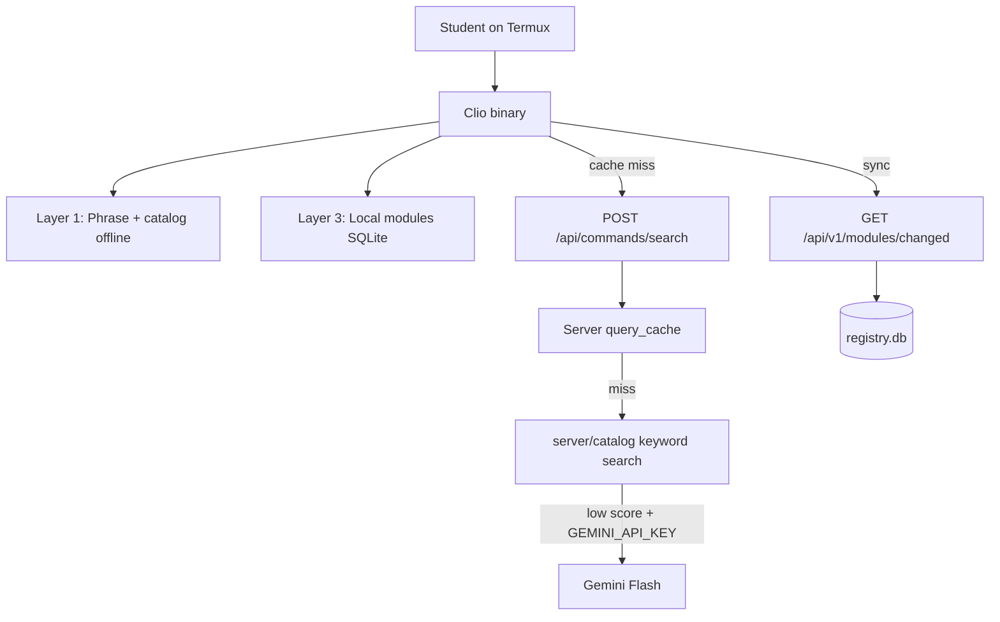

# CLIPilot + Clio Architecture

CLIPilot is the **registry server**. **Clio** is the only supported CLI client.



## Clio client ([github.com/themobileprof/clio](https://github.com/themobileprof/clio))

- Offline phrase + verb-noun matching (Nigerian Pidgin aware)
- Local module sync and `clio-run-module` execution
- Remote fallback: `POST https://clipilot.themobileprof.com/api/commands/search`
- Local SQLite cache of remote results (`query_cache` in `~/.clio/clio.db`)

## CLIPilot server (this repo)

| Endpoint | Purpose |
|----------|---------|
| `POST /api/commands/search` | Natural-language command lookup for Clio |
| `GET /api/v1/modules/changed` | Delta module sync |
| `GET /clio` | Install script for Clio |
| `/modules` | Web UI |

### Search handler (`server/handlers/commands.go`)

1. Check SQLite `query_cache` (7 days)
2. Run `server/catalog.Search(query)` on embedded YAML
3. If top score &lt; 4 and `GEMINI_API_KEY` set → Gemini with catalog hints
4. Return `candidates[]` + legacy `results[]` alias

### Catalog (`server/catalog/`)

- Embeds `common_commands.yaml` (~70 tools)
- Adds Termux essentials: `ping`, `pwd`, `ps`, `kill`, `pkg`
- Pidgin token expansion: `wetin`, `comot`, `data`, `jam`, etc.

## Deployment

```bash
go build -o clipilot-server ./cmd/registry
```

Set `GEMINI_API_KEY` for LLM fallback. Catalog search works without it.
